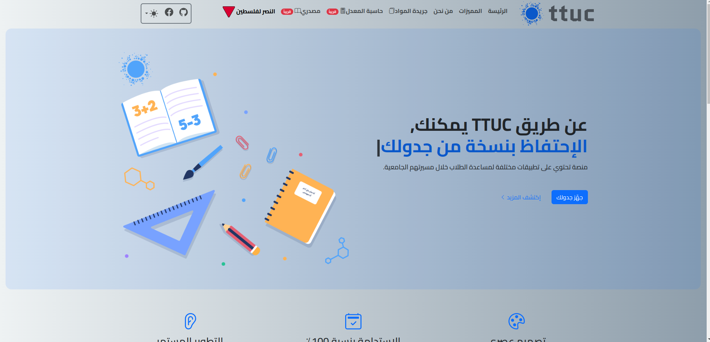

# TTUC Platform

Welcome to the TTUC Platform - Your Academic Companion!

## About
The TTUC Platform is a comprehensive system designed to enhance the academic experience for students, educators, and administrators at Tafila Technical University. It integrates various tools and functionalities to streamline academic processes, improve user experiences, and increase overall efficiency within the university community.

## Key Features
- **Jareeda:** Plan your academic schedule with ease.
- **GPA Calculator[soon]:** Track and analyze your academic performance.
- **Educator Dashboard[soon]:** Manage student registrations and course preferences.
- **Masdary[soon]:** Access academic resources tailored to specific courses.

## Analytics
### Platform Acquisition Overview
- Track user acquisition sources (e.g., direct, referral, organic search).
- Analyze user demographics and geographic distribution.
- Monitor user acquisition trends over time.

### Events Overview
- Monitor user interactions with key platform features and functionalities.
- Analyze event frequencies, durations, and patterns.
- Identify popular features and areas for improvement.

### Tech Overview
- Monitor system performance metrics (e.g., response time, uptime).
- Identify potential bottlenecks and optimize system architecture.

